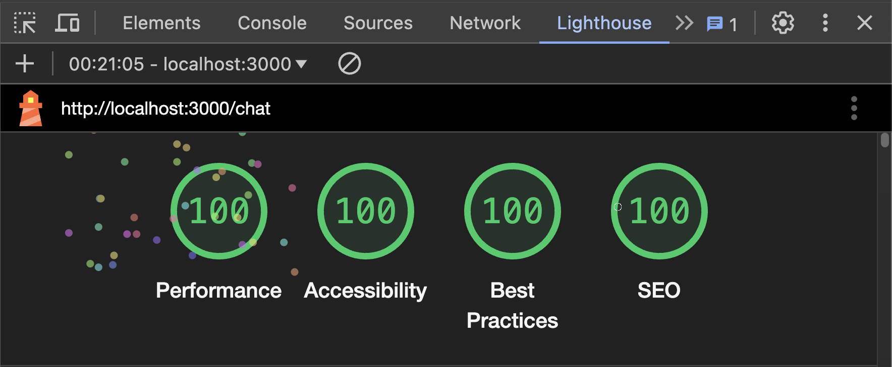

# ChatGPT Clone


This is a minimal clone of the [ChatGPT
website](https://chat.openai.com/).

## Requirements

The specified requirements were the following:

- Use Django as the backend and React as the frontend.
- Allow users to select between GPT-4o and GPT-4o mini and change the
  temperature of the responses (0.2, 0.7, and 0.9).
- Request answers in Markdown format and display the answers in respect
  to the given format.

## Implementation


## Architecture/Design

The project is structured as a monorepo with two services:

- `frontend`: A React application that allows users to interact with the
  GPT-4o model.
- `server`: A Django application that serves as the backend for the
  frontend application.

The frontend service is a Next.js application that uses the `swr`
library to fetch data from the backend service. The backend service is a
Django application that uses the `djangorestframework` library to expose
a REST API that interacts with the OpenAI GPT-4o model.

The UI is built with [Material
UI](https://mui.com/material-ui/getting-started/) components and follows
Google’s Material Design.

## Setup

- Clone the repository
- Create `server/.env` file (cf. `server/.env.example`)
- Restore needed dependencies:

``` bash
# backend
cd server
uv sync --frozen

# frontend
cd frontend
npm install
```

- Run the services:

``` bash
docker-compose up
```

- The frontend service is available at `http://localhost:3000`
- The backend service is available at `http://localhost:8000`

REST API can be interactively explored using Swagger UI:  
`http://localhost:8000/api/schema/swagger-ui/`

## Quality Assurance

### Automated checks

The frontend and backend services have their own quality checks
(linters, formatters, static type checkers, OpenAPI schema validation,
unit testing, code coverage).

Assuming you have the necessary tools locally installed, these checks
can be run locally using the following commands:

``` bash
make qa
```

More specifically:

| Step            | Frontend      | Backend  |
|-----------------|---------------|----------|
| Package Manager | npm           | uv       |
| Formatter       | prettier      | ruff     |
| Linter          | eslint        | ruff     |
| Type checking   | Typescript    | mypy     |
| Unit testing    | jest          | pytest   |
| End-to-end test | Playwright    | \-       |
| Code coverage   | jest          | coverage |
| API client      | axios         | openai   |
| API server      | \-            | django   |
| Import sorter   | import-sorter | ruff     |
| Logger          | pino          | loguru   |

These checks are also run on every push to the repository using GitHub
Actions.

### Manual checks

- UI (Desktop + mobile view) checked on multiple browsers: Chrome,
  Safari, Edge
- Deployment checked on two Operating Systems: macOS, Windows
- Accessibility and performance checks with
  [Lighthouse](https://developers.google.com/web/tools/lighthouse)



## Grievances/Mistakes

- Using Django framework only for the API server seemed like an
  overkill. fastAPI would have been a better choice.

- Using Next.js only for the frontend was a total overkill. A vanilla
  React app would have sufficed. But it was a good exercise to learn
  Next.js, especially server-side rendering, the distinction between
  client and server components, and the API routes.

## Room for Improvement

- Although this is PoC project that uses a monorepo approach to host the
  entire stack, the production-grade project should use separate
  repositories for the ease of development, maintenance, and deployment.

- The project could be improved by adding more features like user
  authentication and saving chat history.
